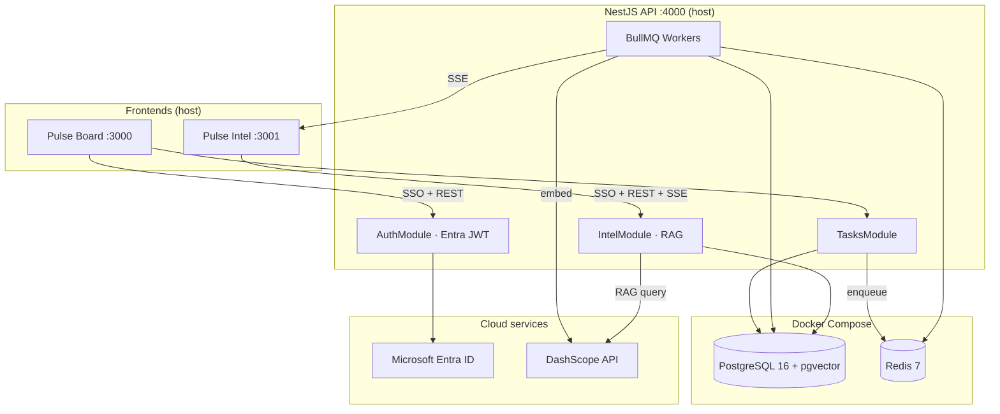

# Pulse

**Purpose:** A self-contained warm-up build that practices the architectural patterns used in RBDOps AI — event ingestion, queue workers, RAG over activity history, Entra SSO/RBAC — without the complexity of the full client system.

> **Status:** Scaffold — infra, schema, and agent docs in place. Application code not yet implemented.

---

## Table of Contents

1. [What Pulse Is](#1-what-pulse-is)
2. [The Two Apps](#2-the-two-apps)
3. [Architecture](#3-architecture)
4. [Tech Stack](#4-tech-stack)
5. [Repository Structure](#5-repository-structure)
6. [Database Schema](#6-database-schema)
7. [Event & RAG Flows](#7-event--rag-flows)
8. [RBAC](#8-rbac)
9. [Local Development](#9-local-development)
10. [Environment Variables](#10-environment-variables)
11. [Build Order](#11-build-order)
12. [Connection to RBDOps AI](#12-connection-to-rbdops-ai)

---

## 1. What Pulse Is

Pulse is a two-app system built around a task board with two twists:

### Health decay

Every task has a health score (0–100) that degrades when untouched:

| Status | Decay rate |
|--------|------------|
| `todo` | 2 pts / hour |
| `in_progress` | 1 pt / hour |
| `review` | 0.5 pts / hour |
| `done` | 0 (frozen) |

Score floors at 0. Cards shift green → amber → red as health drops. A background worker recomputes scores on a schedule (every 15 min) and on each event.

### Mood tagging

Every task update carries a mood tag chosen by the user:

| Tag | Label |
|-----|-------|
| `high` | High energy |
| `medium` | Medium energy |
| `low` | Low energy |
| `neutral` | Neutral |

The second app watches all activity, embeds events into pgvector, and uses an LLM to answer questions like *"What work has been stalling this week?"*

---

## 2. The Two Apps

| App | Path | Port | Users | Description |
|-----|------|------|-------|-------------|
| **Pulse Board** | `apps/board` | 3000 | admin, member | Kanban board — create tasks, move statuses, comment with mood tags |
| **Pulse Intel** | `apps/intel` | 3001 | admin, member, viewer | Live feed, health leaderboard, momentum meter, RAG chat |
| **API** | `apps/api` | 4000 | — | Shared NestJS backend |

Entra app registration (single app, validated in NestJS):

- Redirect URI: `http://localhost:4000/auth/callback`
- Both frontends redirect the user to the API for OIDC login, which issues a JWT

---

## 3. Architecture



### Design decisions

- **Postgres + pgvector co-located** — no separate vector DB; embeddings live in `event_embeddings`
- **BullMQ over RabbitMQ** — same pattern as Tabs vs Spaces, simpler local setup
- **Apps on host, infra in Docker** — fast iteration without rebuilding containers
- **Append-only `task_events`** — lite event sourcing; current task state in `tasks`, history in events
- **Single Entra app registration** — NestJS runs the OIDC code flow via MSAL Node, then issues its own session JWT; both frontends redirect to the API to log in

---

## 4. Tech Stack

| Layer | Technology | Notes |
|-------|------------|-------|
| Auth / SSO | Microsoft Entra ID | Free tier is sufficient; MSAL Node OIDC + passport-jwt session in NestJS |
| Frontends | Next.js 16 (App Router, Turbopack) | TypeScript, Tailwind CSS v4 |
| Backend | NestJS | TypeScript strict, modular |
| Database | PostgreSQL 16 | `pgvector/pgvector:pg16` image |
| Vector store | pgvector | 1536-dim embeddings, HNSW index |
| Queue | BullMQ + Redis (`@nestjs/bullmq`) | One queue (`task-events`), processors per concern |
| LLM | DashScope `qwen-plus` | OpenAI-compatible SDK, intl endpoint |
| Embeddings | DashScope `text-embedding-v3` | 1536 dimensions |
| Runtime | Docker Compose | Postgres + Redis only |
| Monorepo | pnpm workspaces | `@pulse/*` packages |

---

## 5. Repository Structure

```
pulse/
├── AGENTS.md                 # AI agent on-ramp
├── README.md                 # This file
├── .env.example
├── package.json
├── pnpm-workspace.yaml
├── apps/
│   ├── api/                  # NestJS backend
│   ├── board/                # Next.js — Pulse Board
│   └── intel/                # Next.js — Pulse Intel
├── packages/
│   └── shared-types/         # TaskEvent, DTOs, mood enum, constants
└── infra/
    ├── docker-compose.yml    # postgres + redis
    └── postgres/
        └── init.sql          # Schema + extensions
```

---

## 6. Database Schema

Full DDL in `infra/postgres/init.sql`. Summary:

| Table | Purpose |
|-------|---------|
| `users` | Synced from Entra on first login (`entra_oid`, `role`) |
| `tasks` | Current task state including `health_score`, `last_activity_at` |
| `task_events` | Append-only activity log with `mood` |
| `event_embeddings` | pgvector RAG store (`vector(1536)`, HNSW cosine index) |

Key enums (enforced via CHECK constraints):

- **Task status:** `todo`, `in_progress`, `review`, `done`
- **Event type:** `created`, `status_changed`, `commented`, `reassigned`
- **Mood:** `high`, `medium`, `low`, `neutral`
- **Role:** `pulse-admin`, `pulse-member`, `pulse-viewer`

---

## 7. Event & RAG Flows

### Event flow

```
User action (Board)
  → NestJS API
    → INSERT task_events
    → UPDATE tasks.last_activity_at
    → BullMQ job: "task-events"
      → embed-worker    → DashScope embedding → event_embeddings
      → health-worker   → recompute health_score
      → realtime-worker → SSE push to Intel clients
```

Health formula: `100 - (hours_since_last_activity × decay_rate)`, floored at 0.

### Intel AI panel (chat)

- **Persistent per-user chat** in `intel_chat_turns` — survives refresh; `GET /intel/chat` hydrates UI
- Each `POST /intel/query` saves a turn and sends the last 20 completed turns to Qwen as conversation context (plus fresh pgvector RAG context for the new question)
- Scrollable chat UI — user bubbles + streamed assistant replies with per-turn source citations
- Suggestion chips on empty state; input **clears after send**
- **Clear chat** → `DELETE /intel/chat` wipes the user's thread
- Recent activity feed hydrates via `GET /intel/feed/recent`; SSE adds live events after connect

**Existing DBs:** run `infra/postgres/migrations/001_intel_chat_turns.sql` if the table is missing.

### RAG flow

```
User question (Intel AI panel)
  → POST /api/intel/query
    → Embed question (text-embedding-v3)
    → pgvector similarity search (top 10, cosine)
    → Fetch task context for matched events
    → Prompt Qwen with system + context + question
    → Stream response to UI
```

---

## 8. RBAC

Roles map to Entra ID security groups. Group membership arrives in the JWT `groups` claim.

| Role | Entra group | Permissions |
|------|-------------|-------------|
| `pulse-admin` | pulse-admin | Full Board + Intel, manage users |
| `pulse-member` | pulse-member | Create/update tasks, comment, Intel |
| `pulse-viewer` | pulse-viewer | Intel read-only; no Board writes |

API enforcement via `@Roles()` + `RolesGuard` (`AuthGuard('jwt')`) on NestJS controllers.

### Auth flow

```
Frontend → GET /auth/login (API)
  → MSAL getAuthCodeUrl() → Entra login
  → GET /auth/callback (API): MSAL acquireTokenByCode()
    → read oid/name/email/groups claims
    → map groups → role, upsert users row
    → sign app session JWT (JWT_SECRET) { sub, role }
  → frontend stores JWT, sends as Bearer on every request
```

`passport-azure-ad` is deprecated; the OIDC flow uses **MSAL Node** (`@azure/msal-node`). Protected routes validate the app session JWT with **passport-jwt**.

---

## 9. Local Development

### Prerequisites

- Node.js 22+
- pnpm 10+
- Docker Desktop (or Docker Engine + Compose)

### Quick start

```bash
git clone <repo-url> pulse && cd pulse

cp .env.example .env
# Fill in Entra IDs/secrets and DASHSCOPE_API_KEY

pnpm install
pnpm infra:up
```

Verify Postgres + pgvector:

```bash
docker compose -f infra/docker-compose.yml exec postgres \
  psql -U pulse -d pulse -c "SELECT extname FROM pg_extension WHERE extname = 'vector';"

docker compose -f infra/docker-compose.yml exec postgres \
  psql -U pulse -d pulse -c "\dt"
```

Start apps (once implemented):

```bash
pnpm dev:api      # http://localhost:4000
pnpm dev:board    # http://localhost:3000
pnpm dev:intel    # http://localhost:3001
```

Stop infra:

```bash
pnpm infra:down
```

---

## 10. Environment Variables

See `.env.example` for the full list. Key groups:

| Group | Variables |
|-------|-----------|
| Database | `DATABASE_URL` |
| Queue | `REDIS_URL` |
| DashScope | `DASHSCOPE_API_KEY` |
| Entra (single app) | `ENTRA_TENANT_ID`, `ENTRA_CLIENT_ID`, `ENTRA_CLIENT_SECRET` |
| RBAC groups | `ENTRA_PULSE_ADMIN_GROUP_ID`, `ENTRA_PULSE_MEMBER_GROUP_ID`, `ENTRA_PULSE_VIEWER_GROUP_ID` |

### DashScope client setup

```typescript
import OpenAI from 'openai';

const client = new OpenAI({
  apiKey: process.env.DASHSCOPE_API_KEY,
  baseURL: 'https://dashscope-intl.aliyuncs.com/compatible-mode/v1',
});
```

Use the **international** endpoint (`dashscope-intl.aliyuncs.com`), not the China-region URL.

---

## 11. Build Order

| Step | Scope | Status |
|------|-------|--------|
| 1 | Docker Compose + schema | Done |
| 2 | Entra ID setup (tenant, groups, single app registration) — see [`docs/entra-setup.md`](docs/entra-setup.md) | Done |
| 3 | NestJS API skeleton (MSAL OIDC, `/auth/me`, user upsert, passport-jwt, RolesGuard) | Done |
| 4 | Task CRUD + event emission + BullMQ enqueue | Done |
| 5 | BullMQ workers (embed, health cron, realtime/SSE) | Done |
| 6 | RAG query endpoint (`POST /intel/query`, streaming) — see [`docs/dashscope-setup.md`](docs/dashscope-setup.md) | Done |
| 7 | Board UI (Kanban, health badges, mood picker) | Done |
| 8 | Intel UI (SSE feed, leaderboard, momentum, AI panel) | Done |

---

## 12. Connection to RBDOps AI

| Pulse concept | RBDOps equivalent |
|---------------|-------------------|
| Entra SSO + RBAC | Same — Entra ID, role-based alerts |
| `task_events` | `task_history`, communications, meetings |
| BullMQ workers | Ingestion workers per source (Graph, Asana, etc.) |
| Health decay score | Project health score (0–100, weighted signals) |
| Mood tagging | Tone/sentiment on emails + transcripts |
| embed-worker → pgvector | Event embeddings for RAG over activity |
| Intel AI panel | Executive Q&A interface (Phase 2) |
| Momentum meter | Team workload risk indicator |
| SSE real-time feed | Executive daily digest / alert feed |

---

## Patterns practiced

| Pattern | Where in Pulse |
|---------|----------------|
| Event sourcing (lite) | Append-only `task_events` |
| Queue-based async workers | BullMQ: embed, health, realtime |
| RAG | pgvector search → Qwen prompt |
| SSO + RBAC | Entra JWT → RolesGuard |
| Delta/incremental updates | Health cron + event-triggered recompute |
| Adapter pattern | Separate worker per concern |
| Canonical event schema | `@pulse/shared-types` |
| Real-time push | SSE from API to Intel |
