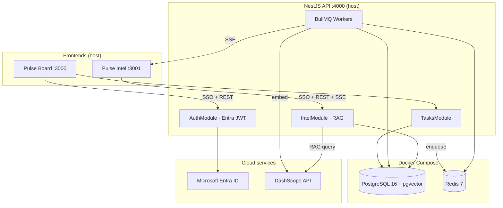

# Pulse

**Purpose:** A self-contained warm-up build that practices the architectural patterns used in RBDOps AI — event ingestion, queue workers, RAG over activity history, Entra SSO/RBAC — without the complexity of the full client system.

> **Status:** Demo POC — Board, Intel, API, workers, RAG chat, and **dynamic multi-dimensional mood** (hybrid sentiment + health → affect plane) are implemented. See [Build Order](#11-build-order).
>
> 📐 **Deep dive:** the mood/sentiment model, calculations, and AI features live in **[`docs/mood-intelligence.md`](docs/mood-intelligence.md)**.
>
> 🎬 **Demoing it?** Step-by-step presenter runbook in **[`docs/demo-guide.md`](docs/demo-guide.md)**.
>
> 🧭 **How it maps to RBDOps AI:** section-by-section PRD alignment in **[`docs/prd-alignment.md`](docs/prd-alignment.md)**.

---

## Table of Contents

1. [What Pulse Is](#1-what-pulse-is)
2. [The Two Apps](#2-the-two-apps)
3. [Architecture](#3-architecture)
4. [Tech Stack](#4-tech-stack)
5. [Repository Structure](#5-repository-structure)
6. [Database Schema](#6-database-schema)
7. [Event & RAG Flows](#7-event--rag-flows)
8. [RBAC](#8-rbac)
9. [Local Development](#9-local-development)
10. [Environment Variables](#10-environment-variables)
11. [Build Order](#11-build-order)
12. [Connection to RBDOps AI](#12-connection-to-rbdops-ai)
13. [Troubleshooting](#13-troubleshooting)

---

## 1. What Pulse Is

Pulse is a two-app system built around a task board with two twists:

### Health decay

Every task has a health score (0–100) that degrades when untouched:

| Status | Decay rate |
|--------|------------|
| `todo` | 2 pts / hour |
| `in_progress` | 1 pt / hour |
| `review` | 0.5 pts / hour |
| `done` | 0 (frozen) |

Score floors at 0. Cards shift green → amber → red as health drops. Health recomputes **immediately after each task event** (via the queue processor); a **15 min cron** catches anything missed.

### Dynamic, multi-dimensional mood

Every task update is read on **three axes**, not one:

| Axis | Source | Range |
|------|--------|-------|
| **Health** | time-decay (above) — objective, *lagging* | 0–100 |
| **Valence** | sentiment of the comment text — subjective, *leading* | −1..1 |
| **Energy** | the `mood` enum (`high`/`medium`/`low`/`neutral`) | 0–1 |

Valence + energy form a **circumplex affect plane** with four named vibes — **In flow**, **Cruising**, **Firefighting**, **Stalled** — and health overlays as a third dimension. Sentiment is produced by a **hybrid pipeline**: a classic lexicon scores valence *instantly* on write, then Qwen *refines* it (valence + inferred energy + emotions) asynchronously in the worker. Mood is **auto-derived** (the picker is an optional override).

Keeping the axes separate surfaces **divergence** — e.g. a frustrated comment on a still-green task ("negative tone while health still green") — the early-warning signal a single blended score would hide.

The second app watches all activity, embeds events into pgvector, plots the team on a 2-D **mood map**, flags divergences, and uses an LLM to answer questions like *"What work has been stalling this week?"*

> Full model, formulas, and AI features: **[`docs/mood-intelligence.md`](docs/mood-intelligence.md)**.

---

## 2. The Two Apps

| App | Path | Port | Users | Description |
|-----|------|------|-------|-------------|
| **Pulse Board** | `apps/board` | 3000 | admin, member | Kanban board — create tasks, move statuses, comment (auto sentiment + optional mood override), activity timeline |
| **Pulse Intel** | `apps/intel` | 3001 | admin, member, viewer | Live feed (valence + divergence flags), health leaderboard, **2-D mood map**, per-task vibe, RAG chat |
| **API** | `apps/api` | 4000 | — | Shared NestJS backend |

Entra app registration (single app, validated in NestJS):

- Redirect URI: `http://localhost:4000/auth/callback`
- Both frontends redirect the user to the API for OIDC login, which issues a JWT

---

## 3. Architecture



### Design decisions

- **Postgres + pgvector co-located** — no separate vector DB; embeddings live in `event_embeddings`
- **BullMQ over RabbitMQ** — same pattern as Tabs vs Spaces, simpler local setup
- **Apps on host, infra in Docker** — fast iteration without rebuilding containers
- **Append-only `task_events`** — lite event sourcing; current task state in `tasks`, history in events
- **Single Entra app registration** — NestJS runs the OIDC code flow via MSAL Node, then issues its own session JWT; both frontends redirect to the API to log in

---

## 4. Tech Stack

| Layer | Technology | Notes |
|-------|------------|-------|
| Auth / SSO | Microsoft Entra ID | Free tier is sufficient; MSAL Node OIDC + passport-jwt session in NestJS |
| Frontends | Next.js 16 (App Router, Turbopack) | TypeScript, Tailwind CSS v4 |
| Backend | NestJS | TypeScript strict, modular |
| Database | PostgreSQL 16 | `pgvector/pgvector:pg16` image |
| Vector store | pgvector | 1536-dim embeddings, HNSW index |
| Queue | BullMQ + Redis (`@nestjs/bullmq`) | One queue (`task-events`), processors per concern |
| LLM | DashScope `qwen-plus` | OpenAI-compatible SDK, intl endpoint; RAG + sentiment refine |
| Embeddings | DashScope `text-embedding-v4` | 1536 dimensions (`text-embedding-v3` caps at 1024) |
| Sentiment | Classic lexicon (AFINN-style) + Qwen | Hybrid: instant lexicon valence → async LLM refine; see [`docs/mood-intelligence.md`](docs/mood-intelligence.md) |
| Runtime | Docker Compose | Postgres + Redis only |
| Monorepo | pnpm workspaces | `@pulse/*` packages |

---

## 5. Repository Structure

```
pulse/
├── AGENTS.md                 # AI agent on-ramp
├── README.md                 # This file
├── .env.example
├── package.json
├── pnpm-workspace.yaml
├── docs/
│   └── mood-intelligence.md  # Sentiment/health/affect model + calculations
├── apps/
│   ├── api/                  # NestJS backend (incl. src/sentiment/ — lexicon + LLM)
│   ├── board/                # Next.js — Pulse Board
│   └── intel/                # Next.js — Pulse Intel
├── packages/
│   └── shared-types/         # TaskEvent, DTOs, mood/sentiment model + vibe helpers
└── infra/
    ├── docker-compose.yml    # postgres + redis
    └── postgres/
        ├── init.sql          # Schema + extensions (fresh DBs)
        └── migrations/       # Incremental migrations (e.g. 002_event_sentiment.sql)
```

---

## 6. Database Schema

Full DDL in `infra/postgres/init.sql`. Summary:

| Table | Purpose |
|-------|---------|
| `users` | Synced from Entra on first login (`entra_oid`, `role`) |
| `tasks` | Current task state including `health_score`, `last_activity_at` |
| `task_events` | Append-only activity log with `mood` (energy), `sentiment` (valence), `sentiment_src`, `emotions`, `mood_manual` |
| `event_embeddings` | pgvector RAG store (`vector(1536)`, HNSW cosine index) |
| `intel_chat_turns` | Per-user Intel AI chat history (question, answer, sources) |

Key enums (enforced via CHECK constraints):

- **Task status:** `todo`, `in_progress`, `review`, `done`
- **Event type:** `created`, `status_changed`, `commented`, `reassigned`
- **Mood (energy):** `high`, `medium`, `low`, `neutral`
- **Sentiment source:** `lexicon`, `llm` (`sentiment` is a `real` in −1..1; nullable)
- **Role:** `pulse-admin`, `pulse-member`, `pulse-viewer`

> **Migrations:** fresh DBs get everything from `init.sql`. **Existing** DBs must run the incremental migrations in `infra/postgres/migrations/` — notably `002_event_sentiment.sql` adds the sentiment columns (idempotent; `task_events` writes fail without it). See [`docs/mood-intelligence.md` §10](docs/mood-intelligence.md#10-storage).

---

## 7. Event & RAG Flows

### Event flow

```
User action (Board)
  → NestJS API
    → score valence instantly (lexicon for comments / transition for status moves)
    → INSERT task_events (sentiment, sentiment_src='lexicon', mood_manual)
    → UPDATE tasks.last_activity_at
    → BullMQ job: "task-events"
      → task-events processor (single consumer):
          → recompute health_score for that task  (first, so the broadcast is fresh)
          → LLM refine sentiment → valence + energy(mood) + emotions  (source='llm')
          → embed event (+ emotions) → event_embeddings
          → SSE push refined item to Intel clients
      → (cron every 15 min: bulk health recompute as safety net)
```

Health formula: `100 - (hours_since_last_activity × decay_rate)`, floored at 0. Sentiment is a two-stage hybrid (instant lexicon → async LLM refine) — full detail in [`docs/mood-intelligence.md`](docs/mood-intelligence.md).

### Mood map & divergence (Intel)

- **2-D mood map** (`GET /intel/momentum2d`) — the team's last-24h activity plotted as a centroid on the valence × energy plane, with per-quadrant counts (In flow / Cruising / Firefighting / Stalled). Replaces the old 1-D momentum meter.
- **Divergence flags** — feed items and the task drawer surface mismatches between what people *say*, how energetic they *seem*, and the objective health (e.g. *"strain behind high energy"*, *"negative tone while health still green"*).
- **Per-task vibe** — the drawer derives a vibe + divergence from the task's most recent scored event, alongside per-event valence + emotion tags.
- **Live updates** — a single shared SSE connection ([`RealtimeProvider`](apps/intel/src/components/RealtimeProvider.tsx)) drives both the feed and a live-refreshing mood map.

### Intel AI panel (chat)

- **Persistent per-user chat** in `intel_chat_turns` — survives refresh; `GET /intel/chat` hydrates UI
- Each `POST /intel/query` saves a turn and sends the last 20 completed turns to Qwen as conversation context (plus fresh pgvector RAG context for the new question)
- Scrollable chat UI — user bubbles + streamed assistant replies with per-turn source citations
- Eight **quick-prompt chips** on empty state (grounded in `pnpm seed:demo` data); input **clears after send**
- **Clear chat** → `DELETE /intel/chat` wipes the user's thread
- Recent activity feed hydrates via `GET /intel/feed/recent`; SSE adds live events after connect
- **Expandable task cards** — leaderboard rows, feed items, and AI source citations open a read-only detail drawer (`GET /intel/tasks/:id`)

### Intel AI quick prompts (demo)

After `pnpm seed:demo`, use these chips in the Intel AI panel. Each targets a different capability the platform is meant to showcase:

| Quick prompt | What it demonstrates |
|--------------|----------------------|
| What are the biggest bottlenecks right now? | **Cross-task synthesis** — surfaces DB migration timeouts, memory leak, Legal blockers, Redis TLS, and other stalled work in one answer |
| Which tasks are at critical risk—and why? | **Health + narrative** — ties low `health_score` leaderboard entries to comment/mood context (e.g. sub-40 tasks) |
| What were our recent sprint wins? | **Positive momentum** — retrieves completed or high-mood wins (API latency fix, rate limiting, Kanban perf, WebSocket failover) |
| What's blocking the user registration deploy? | **Precise retrieval** — Legal/ToS task and Carol viewer comment thread blocking the registration flow |
| How was the API latency spike fixed? | **Root-cause storytelling** — `task_events` missing index, 800ms → 45ms resolution |
| What production alerts came up last night? | **Incident drill-down** — Node worker OOM alerts and uncommitted job loss |
| What's stuck waiting on Legal, DevOps, or AWS? | **External-dependency map** — Redis cert/AWS support, migration DevOps, translation agency, Legal approval |
| What needs a Product decision before Friday? | **Urgency + decision support** — onboarding scope creep vs Friday release cutoff |

Chip copy lives in `apps/intel/src/components/AiPanel.tsx` (`SUGGESTIONS`). The seed script runs overlapping RAG smoke tests against the first, third, and fifth prompts.

### RAG flow

```
User question (Intel AI panel)
  → POST /intel/query
    → Load prior chat turns from DB (multi-turn context)
    → Load live health snapshot (top 15 tasks, lowest health first — same as leaderboard)
    → Embed question (text-embedding-v4)
    → pgvector similarity search (top 10, cosine), drop chunks below RAG_MIN_SCORE
    → Join tasks.health_score into each source; prefix content with health + status
    → Prompt Qwen with system + history + health snapshot + enriched events + question
    → Stream response to UI; persist turn in intel_chat_turns
```

**Health + narrative:** Risk and bottleneck questions use the **live health snapshot** (decay scores from `tasks`). “Why” and blocker detail come from **retrieved activity events** (comments, moods, status changes). Source cards in the UI show both the semantic match % and current health score.

**Answer formatting:** The system prompt (`apps/api/src/intel/prompts.ts`) enforces `-` bullets and `> Why:` blockquotes — no numbered lists. The Intel UI (`format-answer.tsx`) parses that markdown into task cards with health/status chips; it also tolerates legacy `1.` / `→` output by merging split lists.

---

## 8. RBAC

Roles map to Entra ID security groups. Group membership arrives in the JWT `groups` claim.

| Role | Entra group | Permissions |
|------|-------------|-------------|
| `pulse-admin` | pulse-admin | Full Board + Intel |
| `pulse-member` | pulse-member | Create/update tasks, comment, Intel |
| `pulse-viewer` | pulse-viewer | Intel read-only; no Board writes |

API enforcement via `@Roles()` + `RolesGuard` (`AuthGuard('jwt')`) on NestJS controllers.

### Auth flow

```
Frontend → GET /auth/login (API)
  → MSAL getAuthCodeUrl() → Entra login
  → GET /auth/callback (API): MSAL acquireTokenByCode()
    → read oid/name/email/groups claims
    → map groups → role, upsert users row
    → sign app session JWT (JWT_SECRET) { sub, role }
  → frontend stores JWT, sends as Bearer on every request
```

`passport-azure-ad` is deprecated; the OIDC flow uses **MSAL Node** (`@azure/msal-node`). Protected routes validate the app session JWT with **passport-jwt**.

---

## 9. Local Development

### Prerequisites

- Node.js 22+
- pnpm 10+
- Docker Desktop (or Docker Engine + Compose)

### Quick start

```bash
git clone <repo-url> pulse && cd pulse

cp .env.example .env
# Fill in Entra IDs/secrets and DASHSCOPE_API_KEY

pnpm install
pnpm infra:up
```

Verify Postgres + pgvector:

```bash
docker compose -f infra/docker-compose.yml exec postgres \
  psql -U pulse -d pulse -c "SELECT extname FROM pg_extension WHERE extname = 'vector';"

docker compose -f infra/docker-compose.yml exec postgres \
  psql -U pulse -d pulse -c "\dt"
```

Start apps:

```bash
pnpm dev:api      # http://localhost:4000
pnpm dev:board    # http://localhost:3000
pnpm dev:intel    # http://localhost:3001
```

Seed realistic demo data (API + DashScope + Docker must be running):

```bash
pnpm seed:demo
```

`seed:demo` backdates `last_activity_at` per task so target health scores match the decay formula, then derives `health_score` from the same SQL expression the API workers use. See [Troubleshooting](#13-troubleshooting) if health or demo data looks wrong.

**Existing DBs — apply the sentiment migration** (idempotent; required before `task_events` writes work):

```bash
docker compose -f infra/docker-compose.yml exec -T postgres \
  psql -U pulse -d pulse < infra/postgres/migrations/002_event_sentiment.sql
```

**Backfill sentiment** for events created before the feature (so the mood map + divergence have data):

```bash
pnpm --filter @pulse/api build
pnpm --filter @pulse/api backfill:sentiment            # lexicon only (instant, free)
pnpm --filter @pulse/api backfill:sentiment -- --llm   # + LLM energy & emotions
```

Stop infra:

```bash
pnpm infra:down
```

---

## 10. Environment Variables

See `.env.example` for the full list. Key groups:

| Group | Variables |
|-------|-----------|
| Database | `DATABASE_URL` |
| Queue | `REDIS_URL` |
| DashScope | `DASHSCOPE_API_KEY` (powers RAG **and** LLM sentiment refine — no separate key) |
| RAG | `RAG_MIN_SCORE` (relevance floor, default `0.25`) |
| Entra (single app) | `ENTRA_TENANT_ID`, `ENTRA_CLIENT_ID`, `ENTRA_CLIENT_SECRET` |
| RBAC groups | `ENTRA_PULSE_ADMIN_GROUP_ID`, `ENTRA_PULSE_MEMBER_GROUP_ID`, `ENTRA_PULSE_VIEWER_GROUP_ID` |

> The lexicon half of sentiment needs no API key — it always runs. Without a valid `DASHSCOPE_API_KEY`, valence still works (lexicon only); energy stays neutral and emotions are empty (graceful degradation).

### DashScope client setup

```typescript
import OpenAI from 'openai';

const client = new OpenAI({
  apiKey: process.env.DASHSCOPE_API_KEY,
  baseURL: 'https://dashscope-intl.aliyuncs.com/compatible-mode/v1',
});
```

Use the **international** endpoint (`dashscope-intl.aliyuncs.com`), not the China-region URL.

---

## 11. Build Order

| Step | Scope | Status |
|------|-------|--------|
| 1 | Docker Compose + schema | Done |
| 2 | Entra ID setup (tenant, groups, single app registration) — see [`docs/entra-setup.md`](docs/entra-setup.md) | Done |
| 3 | NestJS API skeleton (MSAL OIDC, `/auth/me`, user upsert, passport-jwt, RolesGuard) | Done |
| 4 | Task CRUD + event emission + BullMQ enqueue | Done |
| 5 | BullMQ workers (embed, health cron, realtime/SSE) | Done |
| 6 | RAG query endpoint (`POST /intel/query`, streaming) — see [`docs/dashscope-setup.md`](docs/dashscope-setup.md) | Done |
| 7 | Board UI (Kanban, health badges, mood picker) | Done |
| 8 | Intel UI (SSE feed, leaderboard, momentum, AI panel) | Done |
| 9 | **Dynamic mood — Phase 1:** hybrid sentiment (lexicon + LLM), valence × energy + health, auto-derive/override, schema migration `002`, backfill — see [`docs/mood-intelligence.md`](docs/mood-intelligence.md) | Done |
| 10 | **Dynamic mood — Phase 2:** Intel 2-D mood map, divergence flags, per-task vibe, shared live SSE | Done |

---

## 12. Connection to RBDOps AI

Pulse is a deliberate warm-up for the **RBD AI Operations Command Center** PRD — built on its exact recommended stack to de-risk the architecture. The full section-by-section mapping (✅ demonstrated / 🟡 partial / ⬜ by-design gaps) is in **[`docs/prd-alignment.md`](docs/prd-alignment.md)**. Quick view:

| Pulse concept | RBDOps equivalent |
|---------------|-------------------|
| Entra SSO + RBAC | Same — Entra ID, role-based alerts |
| `task_events` | `task_history`, communications, meetings |
| BullMQ workers | Ingestion workers per source (Graph, Asana, etc.) |
| Health decay score | Project health score (0–100, weighted signals) |
| Hybrid sentiment (lexicon + LLM) | Tone/sentiment on emails + transcripts |
| Valence × energy + health | Multi-signal project read; leading vs lagging indicators |
| Divergence detection | Early-warning alerts (sentiment dropping before health does) |
| task-events processor → pgvector | Event embeddings for RAG over activity |
| Intel AI panel | Executive Q&A interface (Phase 2) |
| 2-D mood map | Team morale / workload risk indicator |
| SSE real-time feed | Executive daily digest / alert feed |

---

## 13. Troubleshooting

Symptom-first fixes for local demo issues. Verify infra and API are up before deeper steps:

```bash
pnpm infra:up
pnpm dev:api    # :4000 — workers run inside the API process
curl -s http://localhost:4000/health
```

### Health badges all green / score 100

| | |
|---|---|
| **Symptom** | Board shows avg health 100, at-risk 0, every card green — often right after seed or after leaving a tab open. |
| **Cause** | Health is **derived** from `last_activity_at` + status decay, not a static field. Workers recompute after every event; a 15 min cron bulk-recomputes non-done tasks. Fresh seed activity sets `last_activity_at ≈ now` → score ≈ 100 until backdating runs. Board can also show **stale React state** from before a reseed. |
| **Fix** | 1. Hard-refresh Board (`Cmd+Shift+R`). Board polls every 45s but an old tab may lag.<br>2. Quick DB repair: `pnpm seed:sync-health` (API can stay running).<br>3. Full reset: `pnpm seed:demo` (API + Docker + `DASHSCOPE_API_KEY` required). |

**Verify DB scores:**

```bash
docker compose -f infra/docker-compose.yml exec postgres \
  psql -U pulse -d pulse -c \
  "SELECT health_score, status, LEFT(title, 40) FROM tasks ORDER BY health_score LIMIT 8;"
```

Expect a spread (e.g. 10–95), not all 100. After `seed:sync-health`, summary logs `at-risk tasks (health < 40): 4`.

---

### Intel live feed empty or “Offline”

| | |
|---|---|
| **Symptom** | “Waiting for activity” / “No activity yet” despite tasks on the Board; red **Offline** badge. |
| **Cause** | SSE (`GET /intel/feed`) only streams events **after** connect — no history on refresh. **Offline** = EventSource disconnected (API down, CORS, or network). |
| **Fix** | 1. Ensure API is running on :4000.<br>2. Feed hydrates history via `GET /intel/feed/recent` on load — check Network tab for 401 (sign in again).<br>3. Create or update a task on Board; a new event should appear if SSE is connected.<br>4. Hard-refresh Intel. |

---

### Intel AI errors / weak answers / “Embeddings unavailable”

| | |
|---|---|
| **Symptom** | AI panel error, empty sources, or generic “I don't have enough information” answers. |
| **Cause** | Missing `DASHSCOPE_API_KEY`, wrong endpoint (China vs intl), workers not embedding events, or empty `event_embeddings`. |
| **Fix** | 1. Set `DASHSCOPE_API_KEY` in `.env`; use intl base URL — see [`docs/dashscope-setup.md`](docs/dashscope-setup.md).<br>2. Restart API after env change.<br>3. Re-seed so workers populate embeddings: `pnpm seed:demo`.<br>4. Check vectors: `SELECT count(*) FROM event_embeddings WHERE embedding IS NOT NULL;` — expect > 0 after seed. |

### AI says no tasks are “at critical risk” (but leaderboard shows red)

| | |
|---|---|
| **Symptom** | Chip *“Which tasks are at critical risk?”* returns “no risk indicators” while the health leaderboard shows low scores. |
| **Cause** | Older builds only passed event text to the LLM — `health_score` lived on `tasks` but not in RAG context. Fixed: every query now injects a live health snapshot + joins health into sources. |
| **Fix** | 1. Restart API (`pnpm dev:api`) after pulling latest code.<br>2. Ask again (or clear chat) — answers should cite health scores and link to comment context.<br>3. Ensure `pnpm seed:sync-health` or `pnpm seed:demo` so scores are varied, not all 100. |

Demo quick-prompt chips are grounded in `pnpm seed:demo` data — run seed before trying them (see [Intel AI quick prompts](#intel-ai-quick-prompts-demo)).

---

### `pnpm seed:demo` fails or hangs

| | |
|---|---|
| **Symptom** | `API not reachable`, embedding wait timeout, or DashScope errors. |
| **Fix** | 1. `pnpm infra:up` — Postgres + Redis must be healthy.<br>2. `pnpm dev:api` on :4000 before seeding.<br>3. Valid `DASHSCOPE_API_KEY` and `JWT_SECRET` in `.env`.<br>4. If queue stuck: restart API, then `pnpm seed:sync-health` or re-run seed.<br>5. Embedding wait defaults to 180s — slow DashScope can timeout; retry once API workers are idle. |

---

### Sign-in / auth / wrong role

| | |
|---|---|
| **Symptom** | Redirect loops, `AADSTS50011`, “Session expired”, or Board blocked for viewer. |
| **Fix** | See [`docs/entra-setup.md`](docs/entra-setup.md) — redirect URI must match `ENTRA_REDIRECT_URI` exactly (`http://localhost:4000/auth/callback`). Group IDs in `.env` must match Entra security groups. `pulse-viewer` is Intel read-only; Board writes require admin or member. |

---

### `intel_chat_turns` / chat history errors

| | |
|---|---|
| **Symptom** | `GET /intel/chat` 500, relation does not exist. |
| **Fix** | DB created before chat table was added — run migration: `infra/postgres/migrations/001_intel_chat_turns.sql`. New installs get the table from `init.sql`. |

---

### Workers / queue not processing

| | |
|---|---|
| **Symptom** | No embeddings, health never updates, Intel feed never gets new SSE events after Board changes. |
| **Cause** | BullMQ workers run **inside the API process** — if API isn't running, nothing processes `task-events`. Redis down or stale queue keys after manual DB truncate. |
| **Fix** | 1. Start or restart `pnpm dev:api`.<br>2. `docker compose -f infra/docker-compose.yml ps` — Redis healthy.<br>3. After `TRUNCATE` without clearing Redis, re-run `pnpm seed:demo` (seed clears `bull:task-events:*` keys).<br>4. Check API logs for `TaskEventsProcessor` / `HealthService` errors. |

---

### Useful diagnostic commands

```bash
# Extensions + tables
docker compose -f infra/docker-compose.yml exec postgres \
  psql -U pulse -d pulse -c "\dt"

# Embedding coverage
docker compose -f infra/docker-compose.yml exec postgres \
  psql -U pulse -d pulse -c \
  "SELECT count(*) AS events FROM task_events;
   SELECT count(*) AS vectors FROM event_embeddings WHERE embedding IS NOT NULL;"

# BullMQ wait depth (0 when idle)
docker compose -f infra/docker-compose.yml exec redis \
  redis-cli LLEN 'bull:task-events:wait'

# At-risk task count
docker compose -f infra/docker-compose.yml exec postgres \
  psql -U pulse -d pulse -c \
  "SELECT count(*) FROM tasks WHERE health_score < 40 AND status <> 'done';"
```

| Command | When to use |
|---------|-------------|
| `pnpm seed:sync-health` | Board/Intel health wrong but tasks exist — no full reseed |
| `pnpm seed:demo` | Empty or stale demo data; (re)build embeddings + RAG smoke tests |
| `pnpm infra:down` / `pnpm infra:up` | Postgres/Redis wedged — **destroys volume data** on down without backup |

---

## Patterns practiced

| Pattern | Where in Pulse |
|---------|----------------|
| Event sourcing (lite) | Append-only `task_events` |
| Queue-based async workers | BullMQ: embed, health, realtime |
| RAG | pgvector search → Qwen prompt |
| SSO + RBAC | Entra JWT → RolesGuard |
| Delta/incremental updates | Health cron + event-triggered recompute |
| Adapter pattern | Separate worker per concern |
| Canonical event schema | `@pulse/shared-types` |
| Real-time push | SSE from API to Intel (shared `RealtimeProvider`) |
| Hybrid sentiment | Instant lexicon baseline → async LLM refine ([`docs/mood-intelligence.md`](docs/mood-intelligence.md)) |
| Multi-dimensional signals | Valence × energy + health; divergence over a blended score |
| Leading vs lagging indicators | Sentiment (leading) paired with health decay (lagging) |
| Graceful degradation | Lexicon works with no LLM; valence survives a missing API key |
