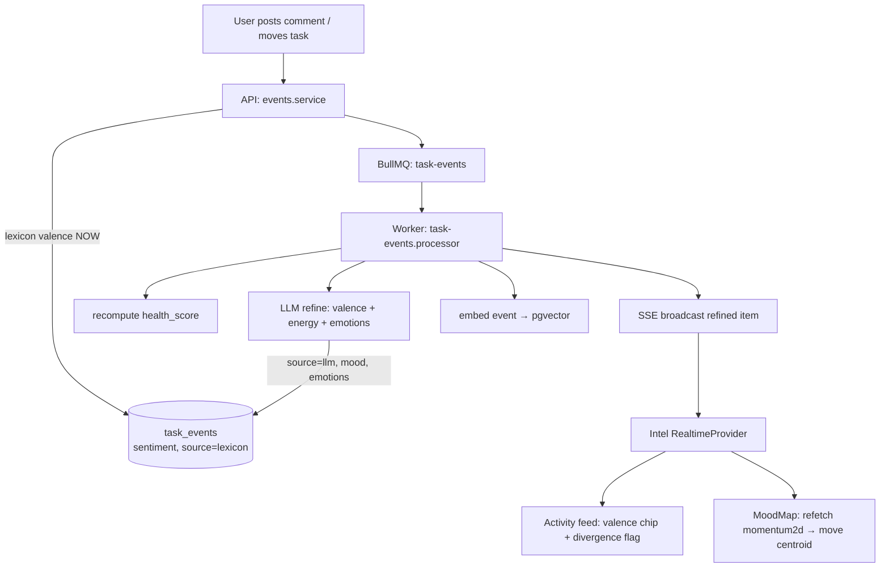

# Mood Intelligence — Sentiment, Health & the Affect Plane

How Pulse turns raw task activity into a **multi-dimensional read on how work feels**: an objective health-decay score, a subjective sentiment (valence) score, and an energy axis — combined into named "vibes" and divergence signals.

> This is the deep-dive companion to the [README](../README.md). The README covers the system; this doc covers the *model and the math*.

---

## 1. The model

Three signals, deliberately kept separate so their disagreements stay visible:

| Axis | Meaning | Source | Range | Nature |
|------|---------|--------|-------|--------|
| **Health** | Is the task going stale? | time-decay from `last_activity_at` + status | 0–100 | objective, **lagging** |
| **Valence** | Does the language sound positive or negative? | sentiment analysis of comments / status moves | −1..1 | subjective, **leading** |
| **Energy** | How much arousal / drive does the update carry? | the `mood` enum (LLM-inferred or manual) | 0–1 | subjective |

Valence and energy form the classic **circumplex model of affect** (a 2-axis plane). Health overlays as a third, objective dimension. The pairing is intentional: **sentiment is a leading indicator** (how people feel *now*) and **health is a lagging one** (how stale things have *become*) — falling sentiment often precedes health decline.

Single source of truth for every constant and helper below: [`packages/shared-types/src/index.ts`](../packages/shared-types/src/index.ts).

---

## 2. Health decay (objective axis)

Each task carries `health_score` (0–100) that decays the longer it sits untouched, at a status-dependent rate:

| Status | Decay rate |
|--------|------------|
| `todo` | 2 pts / hour |
| `in_progress` | 1 pt / hour |
| `review` | 0.5 pts / hour |
| `done` | 0 (frozen) |

**Formula** (floored at 0, capped at 100):

```
health = clamp(0, 100, round( 100 − hours_since_last_activity × decay_rate ))
```

Computed entirely in SQL so there is one definition, in [`apps/api/src/workers/health.service.ts`](../apps/api/src/workers/health.service.ts):

```sql
GREATEST(0, LEAST(100, ROUND(
  100 - (EXTRACT(EPOCH FROM (now() - last_activity_at)) / 3600.0)
        * CASE status WHEN 'todo' THEN 2 WHEN 'in_progress' THEN 1
                      WHEN 'review' THEN 0.5 ELSE 0 END
)))
```

**Two recompute paths** (defense in depth):
- **Event-driven** — `recomputeForTask(taskId)` runs in the queue processor immediately after every task event (the primary path).
- **Cron safety net** — `@Cron('*/15 * * * *')` bulk-recomputes all non-`done` tasks every 15 minutes, catching anything missed.

Any activity resets `last_activity_at = now()`, so health jumps back toward 100 — which is *why* a freshly-commented task can read green even when the comment is full of frustration (see [§7 Divergence](#7-divergence-the-interesting-part)).

Badge bands (`HEALTH_THRESHOLDS`): **green > 70**, **amber 40–70**, **red < 40**.

---

## 3. Hybrid sentiment (valence axis)

Valence is produced in **two stages** — an instant deterministic baseline, then an asynchronous LLM refinement. The user sees a read immediately; a sharper one lands a beat later.

```
Comment posted
  → [write path]  lexicon scores valence NOW  → stored on the event (source: 'lexicon')
  → [queue]       task-events job
       → [worker] DashScope/Qwen scores {valence, energy, emotions}
                  → overwrite valence (source: 'llm'), set energy, attach emotions
```

### 3a. Classic lexicon (instant, deterministic, free)

[`apps/api/src/sentiment/lexicon.ts`](../apps/api/src/sentiment/lexicon.ts) — an AFINN-style approach, no dependencies, English-only:

1. **Tokenize** the comment (lowercase, strip punctuation).
2. Look up each token in a work-flavoured word list scored roughly **−4..4** (`blocked −3`, `nightmare −4`, `shipped 3`, `unblocked 3`, …).
3. **Intensifiers / dampeners** multiply the next word's score (`very ×1.5`, `extremely ×1.8`, `slightly ×0.5`).
4. **Negation** within the preceding 2-token window flips polarity, damped (`×−0.75`).
5. **Normalize** the summed score into (−1, 1) the way VADER does, with α-smoothing:

   ```
   valence = sum / sqrt(sum² + 15)        (then clamped to [−1, 1])
   ```

For **status changes** (no text to read), valence comes from the *direction* of the move via `valenceFromTransition()` — forward progress is positive, regressions negative and weighted heavier:

```
order: todo(0) < in_progress(1) < review(2) < done(3)
delta = order[new] − order[old]
delta > 0 →  min( 0.4, 0.2 × delta)     # forward
delta < 0 →  max(−0.6, 0.3 × delta)     # backward (penalized more)
delta = 0 →  0
```

`created` / `reassigned` events have neither text nor a transition, so they stay unscored (`sentiment = null`).

### 3b. LLM refine (richer, in the worker)

[`apps/api/src/sentiment/sentiment.service.ts`](../apps/api/src/sentiment/sentiment.service.ts) calls Qwen (`qwen-plus`) with `temperature: 0` and `response_format: json_object`, prompt in [`sentiment.prompt.ts`](../apps/api/src/sentiment/sentiment.prompt.ts). Strict JSON contract:

```json
{ "valence": -0.6, "energy": "high", "emotions": ["frustrated", "determined"] }
```

The result is validated and clamped: `valence` → number in [−1, 1]; `energy` → must be one of the mood enum values, else `neutral`; `emotions` → up to 3 lowercase strings. On any failure (or no API key) it returns `null` and the instant lexicon read stands — **graceful degradation, never a hard failure**.

The inferred emotions are also appended to the event's embedded text (`[felt: frustrated, determined]`) so RAG can answer questions like *"what's frustrating the team?"* ([`content-text.ts`](../apps/api/src/workers/content-text.ts)).

---

## 4. Energy axis & auto-derive

Energy reuses the existing `mood` enum, mapped onto 0–1 via `MOOD_ENERGY`:

| `mood` | energy |
|--------|--------|
| `high` | 1.0 |
| `medium` | 0.6 |
| `neutral` | 0.4 |
| `low` | 0.15 |

**Mood is now optional.** Omit it and the LLM infers energy from the comment (`mood_manual = false`). Provide it and it's a manual override the LLM won't touch (`mood_manual = true`). In the UI this is the [`MoodField`](../apps/board/src/components/MoodField.tsx) "Auto / Set manually" control — which also removed the old per-action chore of picking a mood three times.

---

## 5. Vibe quadrants

`classifyVibe(valence, energy)` maps a point on the affect plane to a named quadrant (split at `ENERGY_MIDPOINT = 0.5`):

| | Low energy (< 0.5) | High energy (≥ 0.5) |
|---|---|---|
| **Positive** (valence ≥ 0) | **Cruising** | **In flow** |
| **Negative** (valence < 0) | **Stalled** | **Firefighting** |

A per-task vibe is derived from its most recent scored event; the team vibe is the centroid of recent activity (see §8).

---

## 6. Valence bands

For chips and divergence rules, `VALENCE` thresholds bucket the −1..1 score:

- **positive** ≥ `+0.15`
- **negative** ≤ `−0.15`
- **neutral** in between

---

## 7. Divergence (the interesting part)

A single blended score would *hide* the most useful signal. Keeping the axes separate lets `detectDivergence({ valence, mood, healthScore })` surface the **mismatches** — checked in order, first match wins:

| Condition | Flag | What it means |
|-----------|------|---------------|
| `valence ≤ −0.15` **and** energy ≥ 0.6 | **Strain behind high energy** | Pushing hard through friction / bravado |
| `valence ≥ +0.15` **and** health < 40 | **Upbeat, but health is critical** | Risk being under-reported |
| `valence ≤ −0.15` **and** health > 70 | **Negative tone while health still green** | Early warning before decay shows up |

The third rule is the leading-indicator payoff: because activity resets health toward 100, a frustrated comment on an otherwise-healthy task is exactly the signal that wouldn't surface from health alone. Rendered as amber callouts in the Intel feed and task drawer.

---

## 8. Team momentum (2-D)

`GET /intel/momentum2d` → `IntelService.momentum2d()` aggregates the last **24 h** of events into a `Momentum2D`:

```
valence  = mean(sentiment)  over events where sentiment is not null   (0 if none)
energy   = mean(MOOD_ENERGY[mood])  over all events
vibe     = classifyVibe(valence, energy)                              # centroid quadrant
quadrants = count of events per quadrant, using classifyVibe(sentiment ?? 0, energy)
```

This replaces the old 1-D momentum meter. The Intel [`MoodMap`](../apps/intel/src/components/MoodMap.tsx) renders it as the team centroid plotted on the valence × energy plane with per-quadrant counts.

> The legacy `MOOD_WEIGHTS` (high 4 / medium 3 / neutral 2 / low 1) and `GET /intel/momentum` remain for the old 1-D average but are no longer surfaced in the UI.

---

## 9. End-to-end data flow



The worker order matters: **health recomputes first** (so the broadcast carries fresh health for divergence), then enrich → LLM refine → embed → broadcast. One SSE connection ([`RealtimeProvider`](../apps/intel/src/components/RealtimeProvider.tsx)) fans the refined event to both the feed and the mood map.

---

## 10. Storage

Columns on `task_events` (migration [`002_event_sentiment.sql`](../infra/postgres/migrations/002_event_sentiment.sql); fresh DBs get them from `init.sql`):

| Column | Type | Meaning |
|--------|------|---------|
| `mood` | text enum | energy axis (LLM-set unless overridden) |
| `mood_manual` | boolean | true = user picked the mood; LLM must not overwrite |
| `sentiment` | real | valence −1..1; `null` = unscored |
| `sentiment_src` | text | `'lexicon'` (instant) or `'llm'` (refined) |
| `emotions` | jsonb | LLM discrete emotions, e.g. `["frustrated","determined"]` |

`real` (not `numeric`) so `pg` returns a JS number directly.

---

## 11. Backfill

Existing events created before this feature have `sentiment = null`. The one-off backfill scores them, reusing the exact lexicon + LLM code: [`apps/api/src/backfill-sentiment.ts`](../apps/api/src/backfill-sentiment.ts).

```bash
pnpm --filter @pulse/api build
pnpm --filter @pulse/api backfill:sentiment            # lexicon only (instant, free)
pnpm --filter @pulse/api backfill:sentiment -- --llm   # + LLM energy & emotions
```

It scores `commented` events (lexicon, optionally LLM-refined for energy + emotions) and `status_changed` events (transition direction); `created` / `reassigned` are skipped (nothing to read). Safe to re-run — it only touches rows where `sentiment IS NULL`.

---

## 12. Where it lives

| Concern | File |
|---------|------|
| Constants, vibe/divergence helpers, types | `packages/shared-types/src/index.ts` |
| Classic lexicon + transition valence | `apps/api/src/sentiment/lexicon.ts` |
| LLM sentiment service + prompt | `apps/api/src/sentiment/sentiment.service.ts`, `sentiment.prompt.ts` |
| Instant valence on write | `apps/api/src/events/events.service.ts` |
| LLM refine in the worker | `apps/api/src/workers/task-events.processor.ts` |
| Health decay | `apps/api/src/workers/health.service.ts` |
| 2-D momentum endpoint | `apps/api/src/intel/intel.service.ts` (`momentum2d`) |
| Backfill | `apps/api/src/backfill-sentiment.ts` |
| Mood map (Intel) | `apps/intel/src/components/MoodMap.tsx` |
| Feed valence + divergence | `apps/intel/src/components/ActivityFeed.tsx` |
| Task vibe + divergence + emotions | `apps/intel/src/components/TaskDetailDrawer.tsx` |
| Live SSE fan-out | `apps/intel/src/components/RealtimeProvider.tsx` |
| Auto / manual mood control | `apps/board/src/components/MoodField.tsx` |
